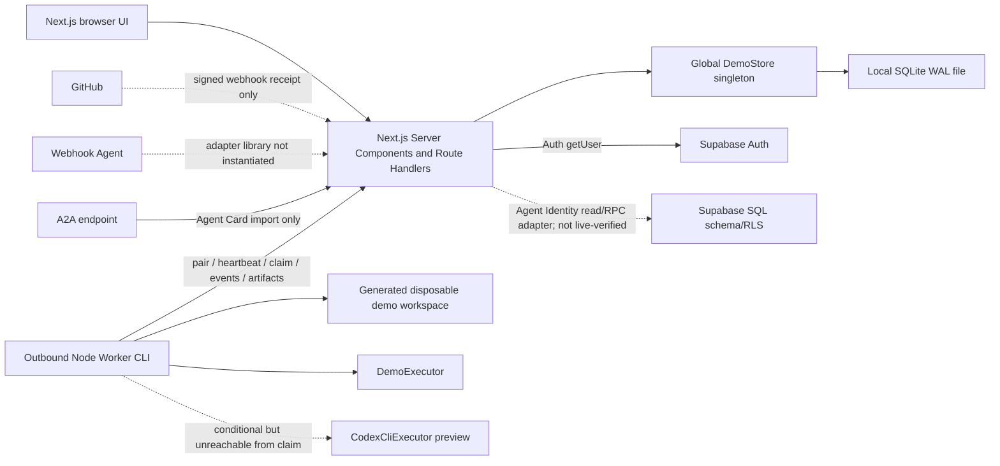
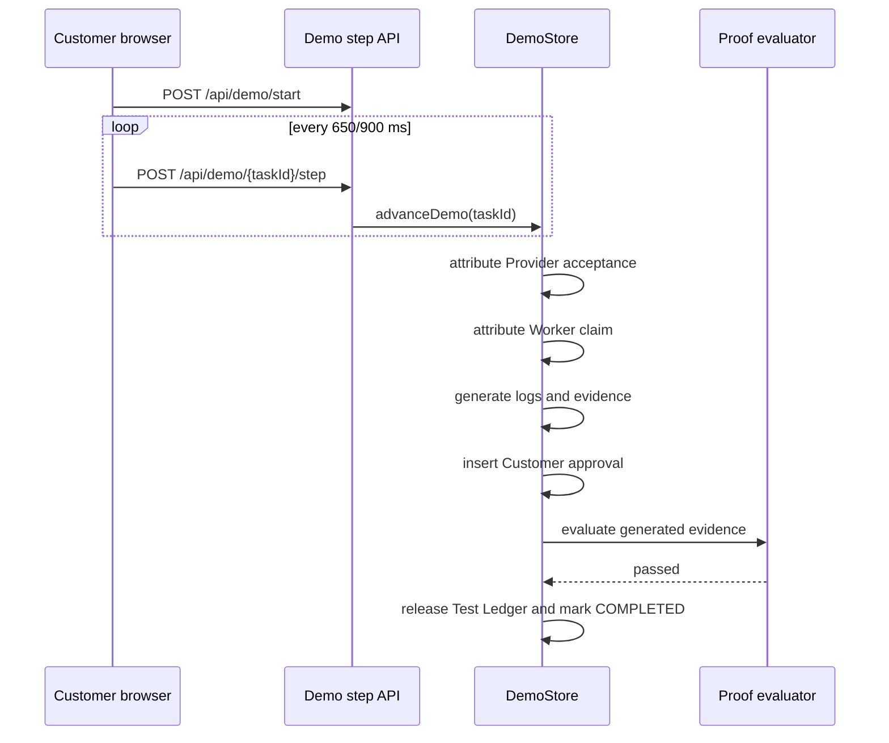

# DoneLayer Current Architecture (Reality View)

This document describes the code that is actually connected at runtime on 2026-08-02. It supersedes aspirational statements in `docs/architecture.md` for planning purposes.

## Documentation Status Update (2026-09-03)

The 2026-08-02 topology and the 2026-08-31 managed-Sandbox section below are
preserved reality snapshots. Later exact-Fixture build/test, bounded Agent
repair, real GitHub branch/Commit/open-PR delivery, and fresh independent
verification evidence are recorded in `docs/CURRENT_PHASE.md`,
`PRODUCT_REALITY_AUDIT.md`, and their Gate reports. Those narrow Gates do not
make the legacy Demo topology or general production integrations real.

`docs/PRODUCT_ROADMAP.md` is the canonical long-term roadmap. Its Verified Work,
task-scoped Authority, Identity/interoperability, Reputation, Payment,
Settlement, organizational trust, and market phases define the ordered product
plan. Only the bounded components explicitly recorded below and in
`docs/CURRENT_PHASE.md` are connected; that file remains the implementation
authority.

The 2026-09-03 strategic realignment makes Verified Work the first product
wedge without reducing the destination to verification alone. HOL is recorded
as a competitor, ecosystem, and optional interoperability target. The later
Identity Gate added typed ERC-8004 and HOL/UAID references only; it did not
connect either external ecosystem, Reputation, payment, or a blockchain.

## Canonical Verified-Work Execution update (2026-09-14)

The Supabase-mode execute route now crosses one closed workflow registry before
selecting an executor. The historical Beta Gate 3 executor remains the only
live feature executor, but its persistence wrapper now calls canonical
service-only primitives:

```text
authenticated Work owner
-> server workflow registry
-> locked Contract + approved task Authority + exact Source validation
-> atomic Assignment / Job / Worker Lease / Permission Lease
-> immutable canonical execution envelope and audit events
-> executor and independent verifier
-> strict canonical finalization or idempotent fail-closed transition
```

`verified_work_execution_envelopes` binds the Contract ID/hash, Authority
ID/scope hash, repository, Commit, optional tree, registered workflow source,
permission snapshot, Assignment, Job, and Lease identities. Preparation holds a
Work-row lock and uses a unique stable idempotency key. Finalization rechecks the
same immutable lineage, active ownership, Evidence/Artifact links, required
acceptance checks, independent verification, cleanup, and policy-violation
state. Failure appends audit Evidence, preserves the reason, and closes Leases.

The migration and runtime boundary are locally validated but not live-applied:
Supabase CLI authentication was unavailable before any project link or change.
The Gate 4A workflow is registered for side-effect-free precheck only; its
feature executor, Contract lock, Job, model call, and Sandboxes remain absent.
The approved three candidate files were not modified. Historical Gate 3 records
and `NOT_VERIFIED / BETA_GATE_VALIDATION / 0 / 0` classification are unchanged.

## Verified Work Contract V1 reality update (2026-09-03)

One additional narrow server-side path is now evidence-backed:

```text
locked VERIFIED_WORK_CONTRACT_V1
-> bounded Agent repair in Vercel Sandbox
-> VERIFIED_WORK_EVIDENCE_BUNDLE_V1
-> source-only GitHub branch / Commit / open PR
-> fresh NON_AI_DETERMINISTIC_VERIFIER Sandbox
-> Evidence Ledger and Verified Work Receipt
-> simulated Test Ledger release
```

The Work Contract reuses the existing Task Contract and Permission foundations;
the Evidence Bundle reuses Source Manifest, repair Receipt/patch, delivery diff,
independent verifier, Ledger, and public Receipt primitives. A complete bundle
does not replace verification: all execution, test, Contract, and delivery
dimensions must independently pass.

This path is REAL only for the exact owner-controlled Fixture branches and
Commits, captured model repair, GitHub PR #2, and evidence in
`VERIFIED_WORK_CONTRACT_V1_REPORT.md`. It is not connected to general task
creation, arbitrary repositories, production GitHub App grants, real payment,
portable credentials, or later roadmap phases. The legacy Demo topology below
is otherwise unchanged.

## Task-Scoped Agent Authority V1 reality update (2026-09-03)

The semantic Work Contract path now has a server-side authority layer that
extends `PermissionLeaseEnvelope` and `PermissionGuard`:

```text
locked Work Contract
-> DoneLayer Server authority decision
-> exact finite Permission Lease
-> guarded Source / Sandbox / patch / delivery / PR / verifier operations
-> allow or deny Evidence
-> Lease revocation
-> authority-bound Receipt
```

The Lease binds the Contract, issuer, Agent/executor/Job, exact Fixture Source,
delivery namespace, file scope, actions, Sandbox boundary, limits, and approval
requirements under one authority hash. Existing detailed Sandbox guards and
GitHub Provider validation remain in place beneath this task-level check.

The live proof exercised only an exact read-only GitHub identity action. The
semantic repair/delivery integration and negative scopes are locally tested;
they were not used to create another model run, Sandbox, branch, PR, merge, or
deployment. General persistence, Human approval UX, credential minting, and
organization/data/external-service enforcement are not connected.

## Agent Identity And Interoperability V1 reality update (2026-09-03)

The semantic trust path now has an identity-aware layer:

```text
opaque internal Agent ID
-> append-only hashed profile revision and platform controller
-> Work Contract assignment
-> Permission Lease subject
-> distinct execution identity
-> Evidence Ledger
-> historical identity snapshot in Receipt
```

An identity-aware Contract fails closed when its Agent profile reference does
not match the Lease, execution, Job, executor, Evidence, or Receipt. Profile
display metadata can change without changing the Agent ID or rewriting old
Receipt meaning. Disabled Agents cannot begin new identity-bound executions,
and a revoked V1 profile is terminal.

External identities use versioned typed references and explicit `DECLARED`,
`OBSERVED`, or `VERIFIED` levels. The original Gate recorded only local
`DECLARED` ERC-8004 and HOL/UAID test vectors.

The 2026-09-08 durable productization milestone now connects the same identity
domain to the current Marketplace SQLite authority:

```text
Marketplace Agent transaction
-> append-only canonical profile revisions
-> immutable external identity ownership
-> controller-only history/revision/link API
-> Agent profile trust projection
```

New and platform-managed Agents receive identity revision 1 in the same
transaction; existing Agents are migrated with an audit event. SQLite triggers
enforce predecessor hashes, monotonic revisions, stable controllers, and
no-update/no-delete records. The public profile derives active Authority and
prior work only from current Leases and valid, non-invalidated Receipts; Demo
counters are not proof. API callers may add only `DECLARED` external links.

This remains local single-process SQLite productization, not Supabase or
multi-instance production persistence. No external resolution, chain
registration, token, ownership challenge, Sandbox, model call, Repository
mutation, payment, Reputation, or deployment is connected by this milestone.

## Agent Identity production persistence contract update (2026-09-08)

The identity-specific server path is now mode-aware. In `APP_MODE=supabase`,
Agent creation plus identity revision 1 uses one service-only Postgres command;
later identity revisions and declared external links use a second service-only
append command. Historical reads use an authenticated Supabase client and RLS.
The migration enforces monotonic predecessor chains, stable controllers,
append-only rows, immutable global external-identity ownership, explicit grants,
and durable audit events.

This is a locally tested production contract, not a live Supabase result. No
linked Postgres project was read or changed, the migration was not executed
against Postgres, and the remainder of the Marketplace still uses `DemoStore`.

## Managed Sandbox reality update (2026-08-31)

The historical topology below remains accurate for the legacy Demo product.
One additional narrowly connected execution path is now REAL:

```text
Server-side ManagedSandboxOrchestrator
-> locked Task Contract and active Permission Lease
-> VercelSandboxProvider using development OIDC
-> non-persistent Vercel remote microVM
-> fixed platform smoke or timeout program only
-> real Provider logs and Artifact bytes
-> Server SHA-256, Evidence Ledger and lifecycle verification
-> Verified Job Receipt for the successful smoke only
```

The Agent, Server-side Orchestrator, `MANAGED_REMOTE_SANDBOX` execution backend,
Vercel Sandbox Provider, and individual Sandbox Instance are separate records.
The platform-managed execution node is not represented as an ordinary local
Worker and receives no Worker token or capability snapshot. Provider credentials
remain in the Server process and only the two non-sensitive Job/Run correlation
values enter the workload.

This path is verified only for `MANAGED_REMOTE_SANDBOX_SMOKE_V1` and
`MANAGED_SANDBOX_TIMEOUT_PROBE_V1`. Repository code, install/test/build, Codex,
branch/commit/PR and production deployment remain outside the connected path.
See `MANAGED_SANDBOX_REALITY_REPORT.md`.

## Runtime topology



## Authoritative components

| Concern | Actual authority | Notes |
| --- | --- | --- |
| Human identity | Demo signed cookie by default | Three fixed identities; Supabase mode verifies the Auth user and keeps application roles in trusted app metadata |
| Application data | `getDemoStore()` except identity APIs in Supabase mode | Agent create/revise/link/read is mode-aware; remaining pages and routes still read SQLite |
| Database | Node `DatabaseSync` SQLite by default | Supabase Agent Identity migration/adapter exists but has not run against Postgres |
| Task transition rules | `packages/task-state-machine` | Real in-process guard called by DemoStore |
| Matching | `packages/matching` | Deterministic algorithm using untrusted/seed metadata |
| Worker protocol | `packages/worker-protocol` | Real Zod envelopes and HTTP primitives |
| Execution selected by platform | Always Demo | Claim route hardcodes `executor.kind = demo` |
| Repository selected by platform | Always Demo | Claim route parses text as `demo://owner/name` |
| Verification | DemoStore + pure evaluator | Same Web process; no fresh checkout or command execution |
| Evidence storage | SQLite content/base64 | Direct Demo insert path and scoped upload path coexist |
| Payment | DemoStore Test Ledger | No real provider; separate `TestLedgerProvider` class is unused |
| Audit | SQLite rows | Successful mutation/event subset only |

## Two different execution paths

### Path A: Run Full Demo



Characteristics:

- Does not communicate with the Worker process.
- Does not clone or inspect a repository.
- Does not execute Build or Test.
- Does not create a branch, commit, or PR.
- Does not perform independent verification.
- Persists every simulated state and therefore survives refresh.

### Path B: Outbound Worker protocol

```mermaid
sequenceDiagram
  participant P as Provider UI
  participant W as Worker CLI
  participant API as Web API
  participant DS as DemoStore

  P->>API: accept offer
  API->>DS: create QUEUED DEMO job
  W->>API: heartbeat and claim
  API->>DS: acquire lease; Task RUNNING
  API-->>W: Demo executor + Demo repository envelope
  W->>W: generate sample workspace
  W->>W: run DemoExecutor
  W->>API: events and artifact upload
  W->>API: structured result
  API->>DS: Task SUBMITTED
  Note over API,DS: No scheduler automatically starts verification
  Note over API,DS: Customer must use demo step to continue
```

Characteristics:

- Pairing/token/heartbeat/lease/event primitives are real local HTTP operations.
- Job construction is Demo-only.
- Non-demo repository materialization is explicitly rejected by Worker code.
- Claim can strand a task before envelope validation reaches the Worker.
- Failed/expired leases have no running scheduler or reassignment path.
- Cancellation polling exists, but server control always returns `cancelRequested: false`.

## Optional code that is not a product path

| Code | Runtime reality |
| --- | --- |
| `CodexCliExecutor` | Instantiated only when Doctor passes Git/Docker/Codex/flag checks, but claim route never requests it |
| `GithubAppAdapter` | Checks environment configuration and lists permissions; no client/installation/repository methods |
| GitHub webhook route | Verifies HMAC and records a receipt; does not update repository/task/check state |
| `WebhookAgentAdapter` | Exported and unit tested; never instantiated by Web/Worker orchestration |
| A2A Adapter task methods | Explicitly throw unsupported; only Agent Card import is connected |
| Supabase migration/RLS | Agent Identity runtime adapter and local contract tests; remaining store/storage adapters absent |
| `TestLedgerProvider` | Unit-tested in-memory class; DemoStore contains a separate ledger implementation |
| Stripe provider | Deliberate throwing skeleton |
| MCP capabilities | Strings used for display/matching; no product invocation or credential broker |

## Data and trust boundaries

### Current trusted data

- Server-generated UUIDs, timestamps, local hash calculations, signed Demo sessions, Worker token/lease digests.
- SQLite transaction boundaries within one Web process.
- Pure state transition rules and pure acceptance-check evaluation logic.

### Data incorrectly treated as proof

- Worker-submitted command/test/build records.
- Worker-submitted diff, file manifest, commit SHAs, and PR URL.
- DemoStore-generated screenshot metadata and bytes.
- DemoStore-generated Customer human approval.
- Seeded Worker online status and capability lists.
- Provider-entered Agent capability/performance metadata.

Hashing proves stored bytes did not change after receipt. It does not prove the bytes came from a build, test, GitHub, screenshot, or independent verifier.

## Persistence reality

`DemoStore` is a synchronous SQLite adapter despite `docs/architecture.md` describing a `FileDemoStore`. It creates schema on process start, seeds profiles/Agents/Workers/tasks/wallets, and stores most domain objects as JSON plus indexed columns.

There is no complete `STORE_DRIVER` implementation even though architecture documentation claims one. `APP_MODE=supabase` now changes human authentication and the Agent create/identity API path; all other application pages and Route Handlers still use `getDemoStore()`.

## Deployment reality

- `next.config.ts` uses `output: "standalone"`.
- `npm start` calls `next start`, which warns that it is incompatible with standalone output.
- Running `server.js` alone did not serve client assets from the produced monorepo package.
- Static assets required manual copy into a monorepo-relative nested location during audit.
- No deployment manifest, queue/scheduler process, verifier process, or production observability path is present.

## Architectural constraints for the next milestone

The Real Build Rescue slice should not attempt to make every existing adapter production-ready. It needs a narrow real path with these explicit authorities:

1. GitHub App is authoritative for repository access, base SHA, branch, commit, PR, and PR readback.
2. A real Worker is authoritative only for executor output, never for acceptance.
3. A separate verifier run on a fresh checkout is authoritative for Build/Test.
4. The platform is authoritative for task state, evidence provenance, and customer acceptance.
5. Test Ledger remains explicitly simulated for this milestone.

The required target architecture and file plan are in `REAL_VERTICAL_SLICE_PLAN.md`.
