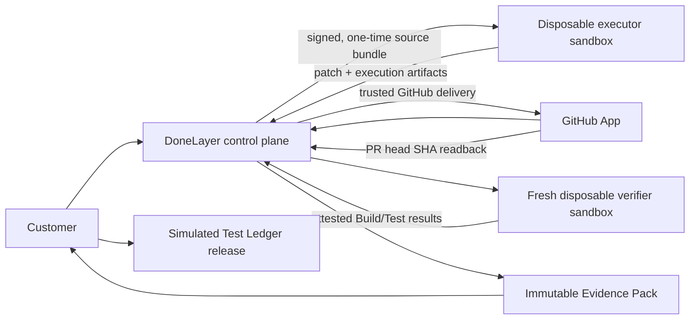

# Real Build Rescue Vertical Slice Plan

> Historical implementation plan. Its exact-Fixture milestones and deviations
> are recorded by the later Gate reports. It is not the current product roadmap
> or implementation authorization. See `docs/PRODUCT_ROADMAP.md` and
> `docs/CURRENT_PHASE.md`.

The plan is preserved without rewriting its original sequencing. The current
roadmap treats its verified exact-Fixture outcome as part of the evidence-backed
foundation and makes Verified Work the first product wedge. General production
GitHub App delivery and other uncompleted targets below remain incomplete.

## The only next milestone

This heading records what was the only next milestone when this historical plan
was written; it is not the current next-step instruction.

**REAL BUILD RESCUE VERTICAL SLICE**

No other product capability should be added until this slice passes its acceptance gate.

```text
Customer selects an accessible GitHub repository
-> creates a BUILD_RESCUE task at an immutable base SHA
-> Provider explicitly accepts
-> a real Worker claims the job
-> Worker receives a verified, one-time repository bundle
-> Codex modifies code in a disposable isolated environment
-> platform creates a real branch, commit, and pull request through GitHub App
-> independent Verifier uses a fresh checkout of the PR head
-> Verifier runs the approved Build/Test commands
-> platform produces a real Evidence Pack
-> Customer accepts
-> Test Ledger releases simulated payment
```

Payment is the only intentionally simulated component.

## Non-goals

- No Webhook Agent execution.
- No A2A task execution.
- No hosted MCP marketplace or credential transfer.
- No Stripe/payment implementation.
- No general task categories beyond `BUILD_RESCUE`.
- No redesign, growth pages, reviews, ratings, or additional dashboards.
- No broad Supabase migration unless shared deployment is required for the slice environment.
- No automatic conversion of existing Demo tasks into real tasks.

## Hard acceptance rules

The real slice must fail closed if any of these are absent:

- GitHub App installation and selected-repository authorization.
- Exact repository ID, owner/name, target branch, and immutable base SHA.
- Worker with the required real executor and isolation capability.
- One-time workspace/bundle bound to Task, Job Run, Worker, and base SHA.
- Successful Codex execution with a captured real diff.
- Server-observed GitHub branch, commit, and PR.
- Independent verifier identity and fresh checkout of the committed head SHA.
- Server-owned Build/Test command registry and successful verifier results.
- Immutable, downloadable Evidence artifacts with provenance and hashes.
- Explicit Customer acceptance after verification.

The following are forbidden in this path:

- `DemoStore.advanceDemo()`
- Demo Repository or generated sample repository
- `DemoExecutor` / `DemoAgentAdapter`
- generated logs, diff, screenshot, test/build result, commit SHA, or PR URL
- Task Detail auto-run `setTimeout`
- Worker claims used directly as acceptance evidence
- inserting human approval during verification
- manually writing `COMPLETED`

## Target trust split



The GitHub App credential must not be exposed to the repository or Codex process. Preferred design:

1. Platform downloads an archive at the selected base SHA and produces a single-use signed bundle for the Worker.
2. Worker runs Codex with network disabled and no GitHub credential.
3. Worker uploads the patch and executor artifacts.
4. A trusted platform delivery service applies the patch at the verified base, creates the branch/commit/PR using GitHub App, then reads the result back.
5. Verifier independently downloads/checks out the PR head and runs commands in a new sandbox.

This is safer than handing a write-capable installation token to untrusted repository code.

## Delivery phases

### Phase 0: Freeze and contract

- Add an explicit `executionMode: DEMO | REAL_BUILD_RESCUE` boundary.
- Hide/disable Real Build Rescue unless all required services are configured.
- Define a dedicated GitHub test organization/repository and branch protection policy.
- Define the one supported stack/command set for the first slice, for example `npm ci`, `npm run build`, and `npm test` only when those scripts exist.
- Write the end-to-end acceptance test before implementation. It must assert GitHub API observations, not UI text.

Exit: a failing test describes the exact real path and no demo code can satisfy it.

### Phase 1: GitHub App repository authority

- Implement installation callback and server-side installation ownership records.
- List only repositories granted to that installation.
- Replace repository text entry with a repository/branch selector.
- Resolve and store immutable repository ID and base SHA at task creation.
- Verify required read/write permissions before reserving Test Ledger funds.

Exit: Task cannot be created with an arbitrary repository string; server can read the exact base commit through GitHub App.

### Phase 2: Real dispatch and source materialization

- Construct the JobEnvelope before acquiring the lease; validate it fully before changing Task to `RUNNING`.
- Select `repository.mode = github-app` and `executor.kind = codex-cli` only for the real slice.
- Create a bounded archive/bundle service with checksum, byte/file limits, safe extraction rules, expiry, and single-use binding.
- Fix Worker Doctor capability reporting for Node/npm and add an explicit isolation capability.
- Implement lease expiry fencing/requeue and persistent cancellation.

Exit: real Worker claims, validates, downloads, verifies, and extracts the exact base SHA into a disposable workspace.

### Phase 3: Isolated Codex execution

- Run Codex inside a disposable container/VM, not merely behind a Docker-available check.
- Mount only the task workspace; provide no home directory, Docker socket, host credentials, or unrelated filesystem paths.
- Disable network for Codex execution.
- Enforce CPU, memory, process, disk, artifact, log, and wall-clock limits.
- Capture pre/post Git state from the host-side runner.
- Treat model-reported test/build data as executor notes only.

Exit: Codex makes a real scoped change; the Worker uploads a real patch and bounded logs; teardown is verified.

### Phase 4: Trusted GitHub delivery

- Platform applies the uploaded patch against the stored base SHA in a trusted workspace.
- Create a collision-resistant task branch.
- Create a real commit with task/job provenance.
- Push/create a real PR through GitHub App.
- Read back repository ID, base SHA, head SHA, branch, commit, PR number/state/URL.
- Reject Worker-provided PR URLs as proof.

Exit: the test repository contains a server-observed branch, commit, and open PR matching the stored patch.

### Phase 5: Independent verifier

- Queue a distinct verifier run with a distinct identity and lease.
- Use a new sandbox and fresh checkout/archive of the PR head SHA.
- Run only server-owned command IDs.
- Capture command, build, test, environment, timing, and checkout provenance.
- Required checks may consume only verifier/GitHub trusted observations, never executor self-reports.

Exit: changing or fabricating executor result JSON cannot make verification pass.

### Phase 6: Evidence, review, and simulated settlement

- Build an immutable Evidence Pack containing source base SHA, executor run, patch, delivery readback, verifier checkout/head SHA, command results, logs, and hashes.
- Make every artifact downloadable and verify MIME/content signatures where applicable.
- Remove auto-created human approval.
- Require explicit Customer acceptance with optimistic task version.
- Release Test Ledger to the Provider from the accepted assignment, not a hardcoded provider ID.

Exit: Customer accepts a verified real PR; balanced simulated ledger entries are posted once; Task reaches `COMPLETED` only through the state machine.

### Phase 7: Recovery and adversarial gate

- Test malformed repository, revoked installation, archive bomb/path traversal, prompt injection, Worker loss, upload failure, lease expiry, duplicate submit, stale Worker, PR API failure, verification failure, and Customer dispute.
- Confirm no secrets in logs, artifacts, diffs, Codex events, or Evidence downloads.
- Confirm a failed run is recoverable without manual status edits.

Exit: all P0 blockers in `SECURITY_BLOCKERS.md` are closed and the real E2E test passes twice from clean state.

## Persistence decision for the slice

SQLite can be retained temporarily as a **single-node control-plane store** for this local vertical slice only if:

- Demo seeding and `advanceDemo()` are not reachable from the real execution mode.
- Store commands are transactional and contract-tested.
- The environment is one Web process and one controlled test repository.
- The result remains classified `PARTIAL` for deployment readiness.

Supabase is required before multi-user/shared production deployment. It is not necessary to prove that GitHub/Codex/Verifier execution is real, and should not expand the first milestone unless the chosen test environment needs remote coordination.

## Required file changes

This is the implementation inventory, not work started by this audit.

### Modify existing files

| File | Required change |
| --- | --- |
| `apps/web/src/components/tasks/create-task-wizard.tsx` | GitHub installation/repository/branch selector; Build Rescue-only real mode; remove arbitrary text repository from real path |
| `apps/web/src/components/task-detail/task-detail-client.tsx` | Remove auto-run timer from real tasks; show real queue/executor/verifier/delivery states; implement artifact downloads |
| `apps/web/src/app/api/tasks/route.ts` | Create real Task from validated repository grant and immutable base SHA |
| `apps/web/src/app/api/tasks/analyze/route.ts` | Keep analysis provenance and avoid repository-aware claims without materialization |
| `apps/web/src/app/api/worker/jobs/claim/route.ts` | Build and validate real envelope before lease; select GitHub/Codex; never parse arbitrary strings as demo repositories |
| `apps/web/src/app/api/worker/job-runs/[jobRunId]/submit/route.ts` | Store executor result as untrusted execution output; trigger trusted delivery, not verification pass |
| `apps/web/src/app/api/worker/job-runs/[jobRunId]/artifacts/init/route.ts` | Generate canonical upload URL and provenance-scoped artifact records |
| `apps/web/src/server/github-app.ts` | Implement GitHub App auth, installations, repositories, archives, branch/commit/PR operations, readback |
| `apps/web/src/server/authorization.ts` | Repository-installation ownership and explicit real-task actor checks |
| `apps/worker/src/doctor.ts` | Correct Node/npm detection; declare isolation/container capability accurately |
| `apps/worker/src/runtime.ts` | Real materialization, container lifecycle, executor provenance, recoverable failure submission |
| `apps/worker/src/workspace.ts` | Replace real-mode rejection with verified bundle materialization; keep Demo path isolated |
| `apps/worker/src/executors/codex.ts` | Execute only inside the container runner; remove PR claim from trusted result; capture real state |
| `packages/worker-protocol/src/types.ts` | Immutable repository identity/base SHA, bundle descriptor, execution mode, provenance, verifier envelopes |
| `packages/worker-protocol/src/schemas.ts` | Validate new real envelopes/results before state mutation |
| `packages/task-state-machine/src/index.ts` | Add/clarify recoverable execution, delivery, and verification transitions if needed; keep completion gate strict |
| `packages/proof-of-done/src/evaluator.ts` | Require trusted provenance per check type and verifier/GitHub observations |
| `packages/database/src/demo-store.ts` | Isolate/remove demo orchestration from real mode; fix provider payout; add real repository/executor/verifier fields or replace through a store port |
| `packages/database/src/schema.ts` | Add installation/repository grants, execution provenance, delivery, verifier, and evidence trust fields for local slice |
| `supabase/migrations/20260731235500_initial_schema.sql` | Mirror final real contracts before production; do not treat current SQL as connected runtime |
| `package.json` / workspace package files | Add official GitHub client and container/runtime dependencies only after design approval |

### Add focused modules

| Proposed file/module | Responsibility |
| --- | --- |
| `apps/web/src/server/services/build-rescue-service.ts` | Single real use-case orchestration and fail-closed gates |
| `apps/web/src/server/services/github-repository-service.ts` | Installation/repository/base-SHA selection and archive generation |
| `apps/web/src/server/services/github-delivery-service.ts` | Trusted patch apply, branch, commit, PR, readback |
| `apps/web/src/server/services/verification-service.ts` | Create verifier job and accept only trusted verifier results |
| `apps/web/src/server/services/evidence-pack-service.ts` | Immutable provenance-aware Evidence Pack |
| `apps/web/src/server/stores/task-store.ts` | Store command interface used by the real slice |
| `apps/web/src/app/api/github/installations/*` | Installation callback/status and repository list endpoints |
| `apps/web/src/app/api/verifier/*` | Verifier claim/events/artifacts/submit endpoints or a role-aware shared protocol |
| `apps/worker/src/materializers/github-bundle.ts` | Safe bundle download, checksum, extraction, manifest |
| `apps/worker/src/isolation/container-runner.ts` | Disposable runtime, mounts, network, resources, teardown |
| `apps/worker/src/verifier.ts` or `apps/verifier/` | Separate fresh-checkout verifier identity/runtime |
| `tests/integration/real-build-rescue.test.ts` | Real service contract with no Demo adapters |
| `tests/e2e/real-build-rescue.spec.ts` | Dedicated GitHub test repo E2E with API readback |
| `tests/security/real-build-rescue-isolation.test.ts` | Secret, path, network, resource, replay, stale lease adversarial cases |

## Final milestone gate

The milestone is accepted only when a recorded run can be independently inspected in GitHub and reproduced by the verifier from a clean checkout. A passing UI test, a Worker JSON result, or a locally persisted `COMPLETED` status is insufficient.

Implementation must not begin until this plan is approved.
